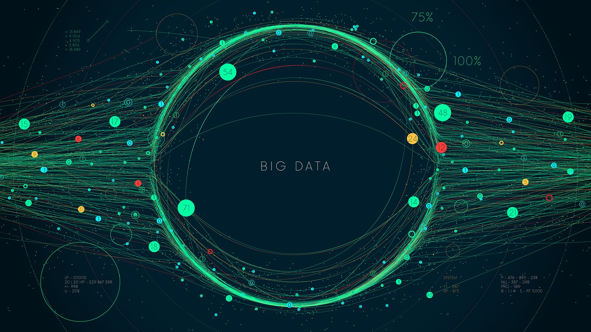

# Big Data

## Project Overview
As a data analyst for BigMarket, a startup that helps businesses optimize their marketing efforts, I've been hired to help a new client, Sellby, perform some pretty hefty analytics. Sellby is preparing to release a large catalog of products on a leading retail website. They want to know how the reviews of their products compare to the reviews of similar products sold by their competitors. They're also interested in enrolling in a program that gives free products to select reviewers, but they want to know if it's worth the cost. There are thousands of reviews and they're in words, not numbers. For this project, I will need to translate them in order to analyze them. Sellby hired BigMarket because they believe in the power of big data. It's now up to me to harness that power!  

## Resources
- **Data Source**: `https://s3.amazonaws.com/amazon-reviews-pds/tsv/amazon_reviews_us_Watches_v1_00.tsv.gz`
- **Software and Tools**: Spark, S3 and RDS from Amazon Web Services, PgAdmin, PySpark, Google Colab Notebooks & Git Bash

## Challenge Deliverables and Results

### Deliverable 1: Perform ETL on Amazon Product Reviews
Using my knowledge of the cloud ETL process, I created an AWS RDS database with tables in pgAdmin. Then, using an Amazon Review dataset for wrist watches, I extracted the dataset into a DataFrame. I transformed the DataFrame into four separate DataFrames that match the table schema in pgAdmin. Finally, I uploaded the transformed data into the appropriate tables and ran queries in pgAdmin to confirm that the data was uploaded.

### Deliverable 2: Determine Bias of Vine Reviews
Using my knowledge of PySpark, I performed analysis on the same Amazon Review dataset for wrist watches to see if there is any bias towards reviews that were written as part of the Vine program. For this analysis, I created multiple filtered DataFrames and performed calculations to determine if having a paid Vine review makes a difference in the percentage of 5-star reviews.

Based on the results of this analysis, I've answered the following questions:

### - **How many Vine reviews and non-Vine reviews were there?**

### - **How many Vine reviews were 5 stars? How many non-Vine reviews were 5 stars?** 

### - **What percentage of Vine reviews were 5 stars? What percentage of non-Vine reviews were 5 stars?** 

## Challenge Summary
In your summary, state if there is any positivity bias for reviews in the Vine program. Use the results of your analysis to support your statement. Then, provide one additional analysis that you could do with the dataset to support your statement.
